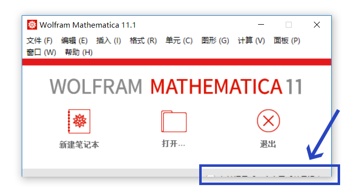

# 设置笔记本
> 客官别急，本节尚未完成，作者正在玩命码字呢，先看看其它主题吧 ^_^

---

## 初始化文件
`init.m` —— 当启动 Mathematica 时执行的脚本文件

在 Mathematica 中可通过此命令打开其所在目录：`SystemOpen[FileNameJoin[{$BaseDirectory,"Kernel"}]]`

更多信息，请在帮助中搜索： `init.m`，然后查看 Details（更多信息和选项）

## 设置背景颜色

打开菜单栏中的：`编辑 > 偏好设置 > 高级 > 打开选项设置 > 笔记本选项 > 显示选项 >`，修改 `Background` 的值即可。

`SetOptions[$FrontEnd,Background->RGBColor[231/255,231/255,231/255]]`


## 退出窗口不完整
如果你退出 Mathematica 时，退出窗口不完整，如下：



以**管理员身份**启动 Mathematica，然后运行下面的代码即可修正之：

```mma

path = $InstallationDirectory <> "/SystemFiles/FrontEnd/TextResources/MathematicaClosingDialog.nb";
If[! FileExistsQ[path <> ".bk"], CopyFile[path, path <> ".bk"]];(*备份*)
nb = Import[path] // NotebookPut;
SetOptions[nb, {WindowSize -> {600, All}, WindowElements -> {"MenuBar"}}];
Export[path, nb];


```
